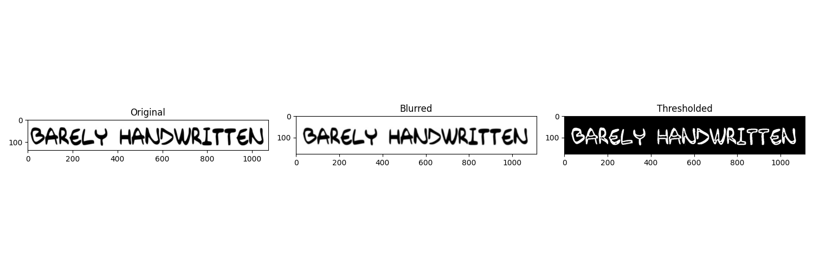
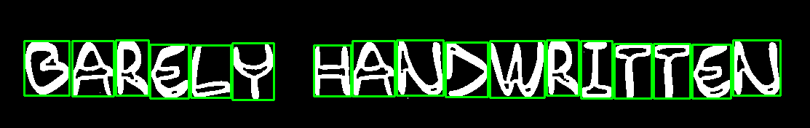
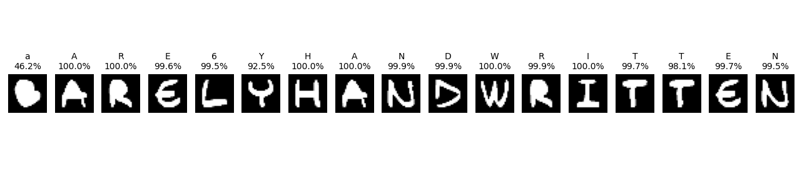

# ✍️ Handwritten Character Recognition from Webcam Input

This project captures handwritten text using a webcam or image, segments it into individual characters, predicts each using a trained CNN model (`English.h5`), and saves the recognized sentence into a Word document with confidence scores.

---

## 🎯 Features

- Captures handwritten text from webcam images
- Segments characters using OpenCV
- Predicts each character using a CNN trained on EMNIST (ByClass)
- Displays prediction results with confidence
- Saves the final recognized text in a `.docx` file

---

## 🖼️ Sample Screenshots

### ➕ Preprocessing Step


### ✂️ Segmentation Visualization


### 🔤 Character Predictions with Confidence


---

## 🛠️ Installation

You’ll need:

* OpenCV (`cv2`)
* TensorFlow / Keras
* NumPy
* Matplotlib
* Python-docx

Or install manually:

```bash
pip install opencv-python tensorflow numpy matplotlib python-docx
```

---

## ▶️ Usage

### 1. Run the Python script

```bash
python main.py
```

* You’ll be prompted to enter the path of the handwritten image (e.g., captured via webcam).
* The image will be processed, segmented, and predicted.
* Results will be saved in `recognized_output.docx`.

### 2. Colab notebook (`English_train.ipynb`)

* Open the notebook in Google Colab.
* Run all cells to train or test the model interactively.

---

## 🧠 Model Used

The script loads a pre-trained CNN model (`English.h5`) trained on the **EMNIST ByClass** dataset. It can recognize:

* 26 uppercase letters
* 26 lowercase letters
* 10 digits

---

## 📂 Files Overview

| File                  | Description                                                                |
| --------------------- | -------------------------------------------------------------------------- |
| `main.py`             | Main script for preprocessing, segmentation, prediction, and saving output |
| `English_train.ipynb` | Colab notebook for training the model                                      |
| `English.h5`          | Pretrained CNN model (not included here; load manually)                    |
| `screenshots/`        | Folder containing visual output of each step                               |

---

## 📄 Output

* `recognized_output.docx`: Final document with:

  * Predicted sentence
  * Average confidence score

---

## 📃 License

MIT License. Feel free to use, modify, and share!

---

## 🙌 Acknowledgments

* EMNIST Dataset by Cohen et al.
* TensorFlow and OpenCV teams for their awesome libraries
